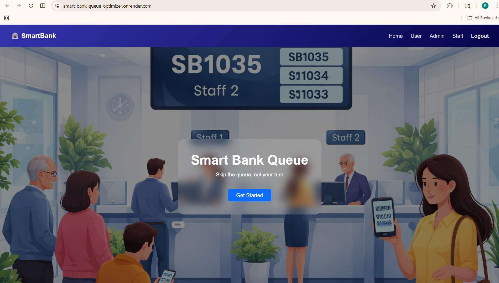
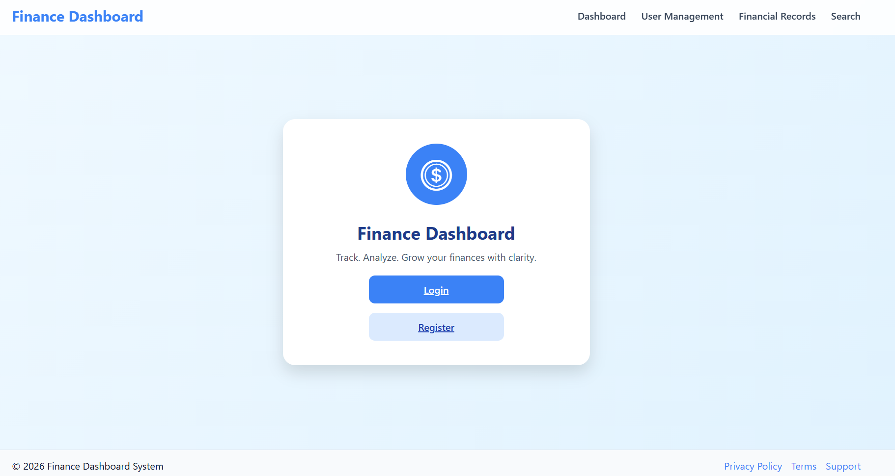
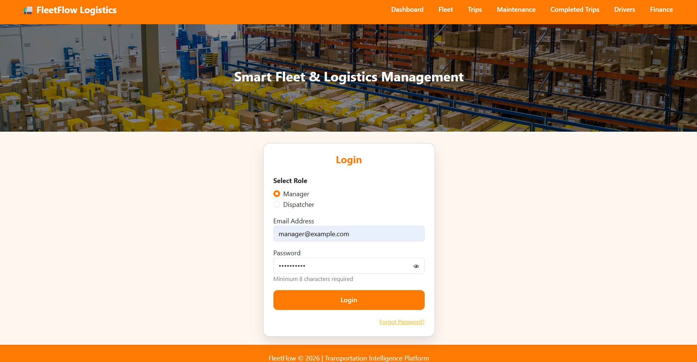
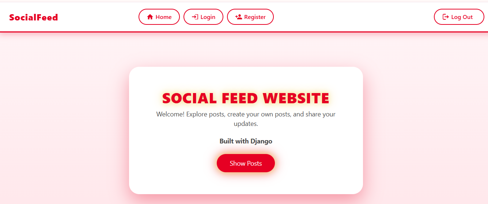
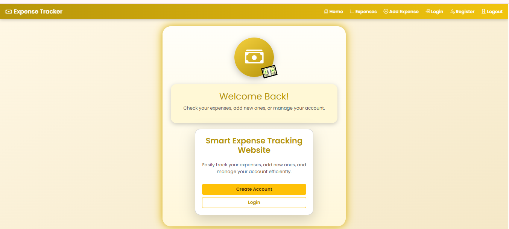
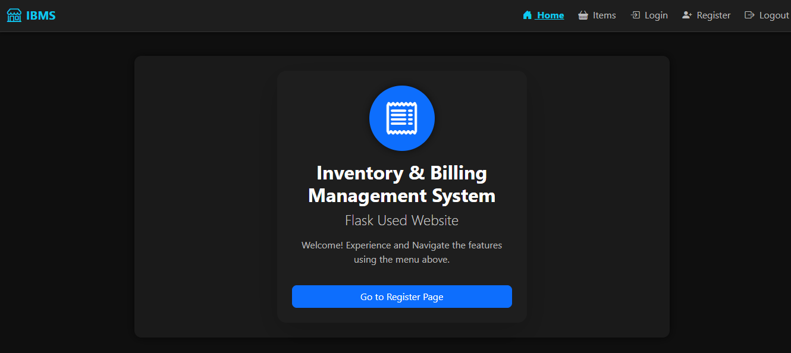
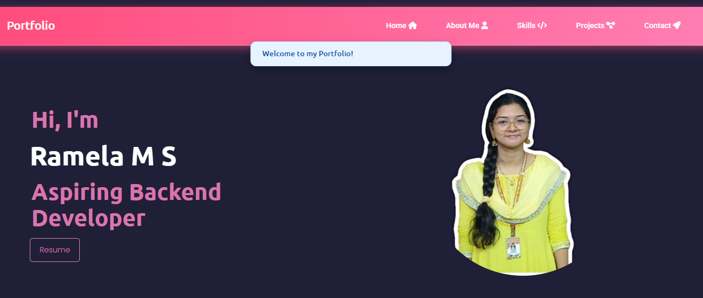

# Hi, I'm Ramela M.S. 👋

Welcome to my GitHub profile! I am a **Computer Science and Business Systems undergraduate** passionate about **Python programming, Backend development, and problem-solving**. I enjoy building **real-world applications** and contributing to projects that make an impact.

---

## 📌 About Me
I’m a **B.Tech student at Panimalar Engineering College** pursuing Computer Science & Business Systems. I have a strong passion for **software development, problem-solving, and building user-friendly applications**.

As a **Freshman selected for the Amazon Future Engineer Bootcamp**, I have strong **Python fundamentals** and hands-on experience in **Django and Flask web development**. I have built multiple Python and web-based projects, including full-stack web applications, and enjoy creating **reliable, user-focused software solutions**.

I am an **enthusiastic learner**, curious about emerging technologies, and always seeking opportunities to **collaborate, innovate, and contribute to impactful projects**.

---

## 🎓 Education
**Panimalar Engineering College** – B.Tech CSBS  
- Duration: 2024 – 2028  
- Academic Excellence: CGPA 8.96 

**Velammal Vidyalaya** – Higher Secondary (CBSE)  
- Grade: 9.4 CGPA (2024)

---

## 💻 Skills

**Programming Languages:** Python (LeetCode, GeeksforGeeks), C  
**Web Technologies:** Django, Flask-RESTful, Flask, Bootstrap, HTML, CSS  
**Databases:** MySQL, Flask-SQLAlchemy  
**Tools:** GitHub, VS Code

---

## 🏆 Professional Development
- **Amazon Future Engineer Bootcamp 2025** – Selected for Phase 1, focused on **Python, AI basics, and problem-solving techniques**.

---

## 📂 Personal Projects

## 🏦 Smart Bank Queue Optimization System

- Built a **Flask-based full-stack Smart Bank Queue Optimization Web Application** with role-based access control and secure authentication.
- Users can **generate tokens, track queue status, and view estimated waiting times**, while staff and admin manage customer flow efficiently.
- **Impact:** Improved queue management efficiency, reduced waiting time, and enhanced service coordination in banking environments.
- **GitHub Repo:** [Smart Bank Queue Optimization System Repo Link](https://github.com/Ramela-M-S/Smart-Bank-Queue-Optimizer/blob/main/README.md)
- **Screenshots / Demo:**
  

## 💰 Finance Dashboard System

- Built a **Flask-based full-stack Finance Dashboard Web Application** with role-based access control and secure authentication.
- Users can **create, manage, and track financial records** while viewing insights through a structured dashboard.
- **Impact:** Improved financial tracking and decision-making through a structured role-based dashboard system.
- **GitHub Repo:** [Finance Dashboard System Repo Link](https://github.com/Ramela-M-S/Finance-Dashboard-System/blob/main/README.md)
- **Screenshots / Demo:**
  

  ## 🚛 FleetFlow - Smart Fleet Management System

- Built a **Flask-based full-stack Fleet Management Web Application** with role-based access control and secure authentication.
- Users can **manage vehicles, drivers, trips, maintenance logs, and operational expenses** through a centralized dashboard, while managers and dispatchers handle daily fleet operations efficiently.
- **Impact:** Improved fleet tracking, reduced vehicle downtime, streamlined trip scheduling, and enhanced operational decision-making through analytics dashboards.
- **GitHub Repo:** [FleetFlow - Smart Fleet Management System Repo Link](https://github.com/Ramela-M-S/Odoo-Fleet-Flow/blob/main/README.md)
- **Screenshots / Demo:**  
  

### Social Feed Website
- Built a **Django-based social feed platform** with Cloudinary for media storage.  
- Users can **create posts, like, comment, and view updates in real-time**.  
- **Impact:** Enabled real-time user interaction via a cloud-backed Django social platform.  
- **GitHub Repo:** [Social Feed Website Repo Link](https://github.com/Ramela-M-S/Social-Feed/blob/main/README.md)  
- **Screenshots / Demo:** 

### Smart Expense Tracking Website
- Developed a **responsive expense tracker** using Flask, Flask-RESTful API, and Flask-SQLAlchemy.  
- Users can **add, edit, and view expenses with monthly summaries**.  
- **Impact:** Improved expense tracking and monthly analysis using RESTful APIs.  
- **GitHub Repo:** [Smart Expense Tracking Website Repo Link](https://github.com/Ramela-M-S/Expense-Tracker-Flask-API-/blob/main/README.md)
- **Screenshots / Demo:**  

### Inventory and Building Management System (IBMS)
- Built an **inventory and building management system** using Flask and Flask-SQLAlchemy for efficient recordkeeping and resource allocation.  
- **Impact:** Streamlined inventory and billing workflows.  
- **GitHub Repo:** [IBMS Repo Link](https://github.com/Ramela-M-S/IBMS-Inventory-System/blob/main/README.md)  
- **Screenshots / Demo:** 
### Portfolio Website
- Built a **personal portfolio website** using Django and Bootstrap to showcase projects, skills, and experience.  
- **Impact:** Provided a professional online presence and easy access to projects and contact information.  
- **GitHub Repo:** [Portfolio Repo Link](https://github.com/Ramela-M-S/Personal-Portfolio/blob/main/README.md)
- **Screenshots / Demo:**  

---

## 🏅 Coding and Technical Achievements
- **First Place – Let’s C Coding Competition:** Won 1st Prize at Madras Institute of Technology in the Let’s C Coding Event (26 February 2026)  
- **First Place – CodeBack Coding Competition:** Won 1st Prize at Chennai Institute of Technology in the CodeBack Coding Event (5 February 2026)  
- **Second Place – Code Euphoria Coding Competition:** Secured 2nd Prize at Chennai Institute of Technology in the Code Euphoria Event (2 February 2026)  
- **First Place – Code Relay Competition:** Won 1st Prize at Vel Tech Multi Tech Engineering College in the Code Relay Event (18 March 2026)  
- **Second Place – QuizStorm Quiz Competition:** Secured 2nd Prize at Vel Tech Multi Tech Engineering College in the QuizStorm Event (20 February 2026)
- **Best Coder Award – Cosmic Duel:** Recognized as Best Coder at Velammal Institute of Technology, Xemplar 2K25 (April 2025)  
- **First Place – CodeChef Coding Competition:** Secured 1st place at Madha Engineering College, CodeChef Contest (April 2025)  
- **Second Place – Decodex Coding Competition:** Meenakshi Sundararajan Engineering College, Pranav 2K25 (16 April 2025) – Achieved second place in a college-level coding competition as part of the technical fest.
---

## 📫 Contact Me
- Email: ramelams07@gmail.com  
- LinkedIn: [LinkedIn Profile Page](https://www.linkedin.com/in/ramela-m-s/)  
- GitHub: [GitHub Profile Page](https://github.com/Ramela-M-S)  
- Portfolio: [ Portfolio Page](https://github.com/Ramela-M-S/Personal-Portfolio/blob/main/README.md)
